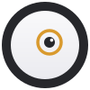
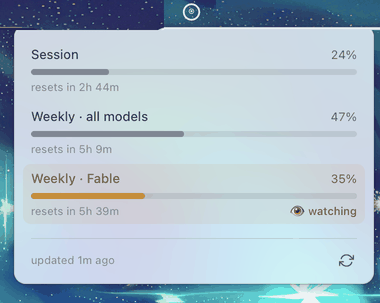
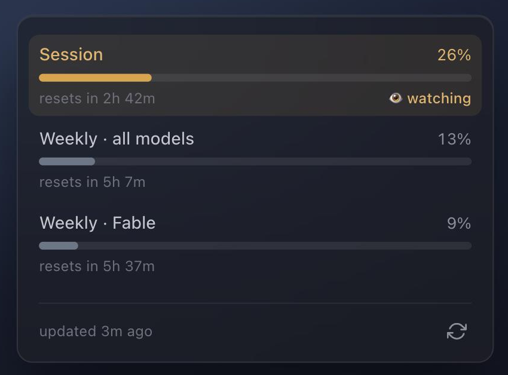

<div align="center">



# mad-eye

**Your Claude usage limits, watching you back.**

A macOS menubar app that shows your Claude subscription usage as an animated eye —
[Mad-Eye Moody](https://harrypotter.fandom.com/wiki/Alastor_Moody) style. The Eye gets more
agitated as you approach a limit, and its ring shatters when you hit 100%. No numbers in your
menubar — just an Eye that tells you how close you are at a glance.

[](https://github.com/kvnwolf/mad-eye/actions/workflows/ci.yml)
&nbsp;
&nbsp;
&nbsp;

<br/>



</div>

---

## Why

If you live in Claude Code, you want an ambient sense of *"how close am I to my limit?"*
without opening a dashboard. mad-eye puts that in your menubar as a single Eye:

- a **calm, slow glance** when you've got headroom,
- a **frantic dart** when you're about to run out,
- a **cracked, frozen stare** when you've hit the wall.

Click it for the detailed gauges.

## The moods

The Eye tracks **one** gauge — your **Session** limit by default. Click any gauge in the
popover to make it the one that drives the Eye (it remembers your choice).

| Usage | Mood | The Eye… |
|:--:|:--|:--|
| `< 50%` | 😌 **Calm** | slow, wide glances |
| `< 80%` | 😐 **Nervous** | quicker, tighter darts |
| `< 95%` | 😰 **Paranoid** | fast, wide, restless |
| `< 100%` | 😱 **Frantic** | can't sit still |
| `100%` | 💥 **Shattered** | the ring cracks, the eye freezes |

<div align="center">

</div>

## Install

> mad-eye isn't code-signed yet (free, unsigned build), so macOS Gatekeeper flags it on first
> launch. Both paths below get you past that.

### Homebrew (recommended)

```sh
brew install --cask kvnwolf/tap/mad-eye && xattr -dr com.apple.quarantine /Applications/mad-eye.app
```

The `xattr` half clears the Gatekeeper quarantine so the unsigned app opens — Homebrew can't skip it,
and the [source is right here to audit](src-tauri/src). Prefer clicking? Install with just the `brew`
half, then approve mad-eye under **System Settings → Privacy & Security → Open Anyway**.

### Manual

Download `mad-eye_<version>_universal.dmg` from [**Releases**](https://github.com/kvnwolf/mad-eye/releases),
open it, and drag **mad-eye** into Applications. Then approve it under **System Settings → Privacy &
Security → Open Anyway**, or clear the quarantine flag yourself:

```sh
xattr -dr com.apple.quarantine /Applications/mad-eye.app
```

## Requirements

- **macOS Monterey or later.**
- **[Claude Code](https://claude.com/claude-code) installed and logged in.** mad-eye reads your
  usage from the same credentials Claude Code stores — no Claude Code, no data (the Eye goes dark).

## Privacy & trust

mad-eye reads your Claude OAuth token from the macOS Keychain **(read-only)** and calls
Anthropic's usage endpoint — the same data behind Claude Code's `/usage` panel. That's the whole
story:

- 🔒 **Your token never leaves your Mac** except to `api.anthropic.com`.
- 🚫 **No telemetry, no analytics, no servers.** There's no backend — just your Mac and Anthropic.
- 👁 **It never writes or refreshes your credentials** — strictly read-only. If the token expires,
  the Eye just goes blind until Claude Code refreshes it.
- On first launch macOS asks to read the *"Claude Code-credentials"* Keychain item — click
  **Always Allow**.

Don't take my word for it — read the [Keychain read](src-tauri/src/keychain/read.rs) and the
[usage fetch](src-tauri/src/usage/client.rs) yourself. That's the whole point of open-sourcing it.

## How it works

- A **Rust core** renders the Eye directly to a monochrome template tray icon (tiny-skia, no image
  assets) and animates the pupil ~30fps by mood.
- It polls Anthropic's OAuth usage endpoint (undocumented — a future change on their side could
  break it) and maps the limits to gauges + a mood.
- The **popover** is a native frosted panel — vanilla TypeScript, macOS vibrancy, theme-aware.
- It's a **ghost app**: no Dock icon, no ⌘-Tab. Launch-at-login and Quit live in the Eye's
  right-click menu.

## Development

```sh
git clone https://github.com/kvnwolf/mad-eye
cd mad-eye
bun install
bun tauri dev        # the native app: menubar Eye + popover
```

Drive the Eye through every mood without burning real usage:

```sh
MAD_EYE_FAKE_PCT=97 bun tauri dev    # 40 calm · 70 nervous · 90 paranoid · 97 frantic · 100 shattered
```

Releases are cut with the [`release`](.claude/skills/release/SKILL.md) skill (universal DMG →
GitHub Release → Homebrew cask).

## License

[MIT](LICENSE) © Kevin Wolf

---

<div align="center"><sub>Built with 🦀 Rust + <a href="https://tauri.app">Tauri</a> · not affiliated with Anthropic</sub></div>
